# 🌱 새싹 (SaeSak)

> **"새로운 사랑이 싹 트는 그곳"**
> 위치 기반 오프라인 만남을 연결하는 데이팅 앱

<br>

## 📱 화면 소개

<table>
  <tr>
    <td align="center"><b>시작 화면</b></td>
    <td align="center"><b>소셜 로그인</b></td>
    <td align="center"><b>프로필 설정</b></td>
    <td align="center"><b>스와이프 탐색</b></td>
  </tr>
  <tr>
    <td></td>
    <td>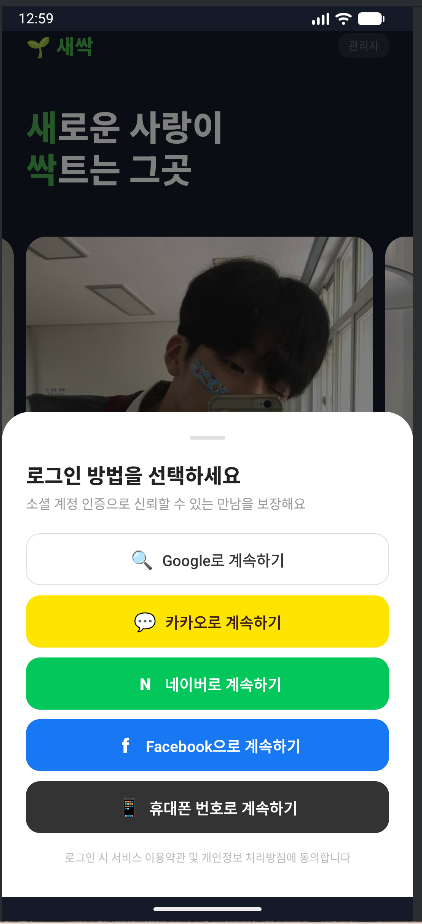</td>
    <td>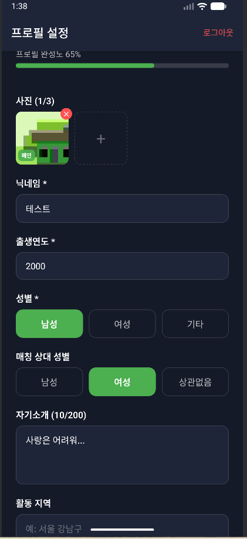</td>
    <td>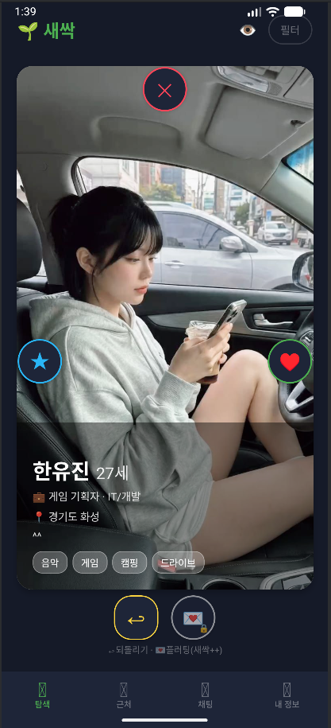</td>
  </tr>
  <tr>
    <td align="center"><b>매칭 필터</b></td>
    <td align="center"><b>지도 탐색</b></td>
    <td align="center"><b>지도 프로필 조회</b></td>
    <td align="center"><b>내 정보</b></td>
  </tr>
  <tr>
    <td>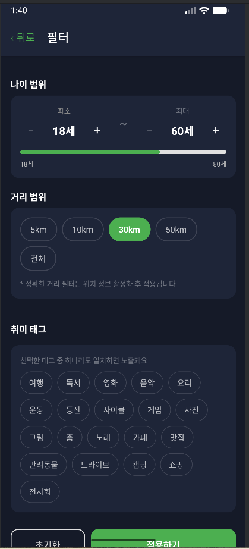</td>
    <td>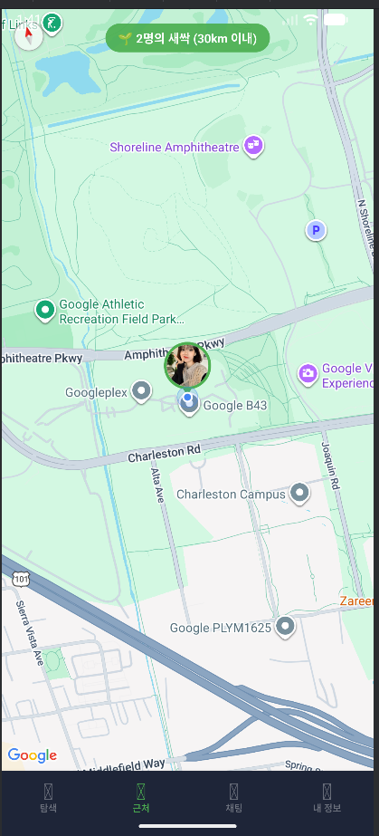</td>
    <td>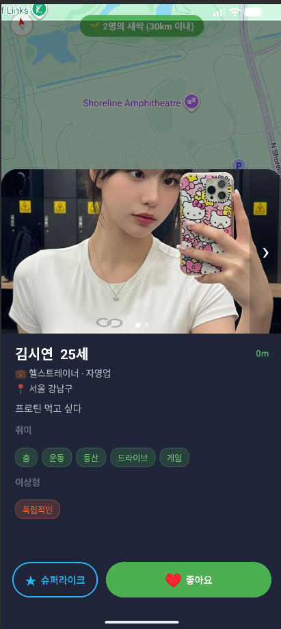</td>
    <td>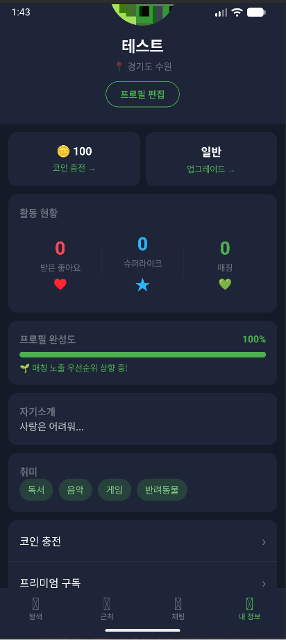</td>
  </tr>
  <tr>
    <td align="center"><b>테마 변경</b></td>
    <td align="center"><b>매칭 성립</b></td>
    <td align="center"><b>채팅방</b></td>
    <td align="center"><b>채팅 내 프로필 조회</b></td>
  </tr>
  <tr>
    <td>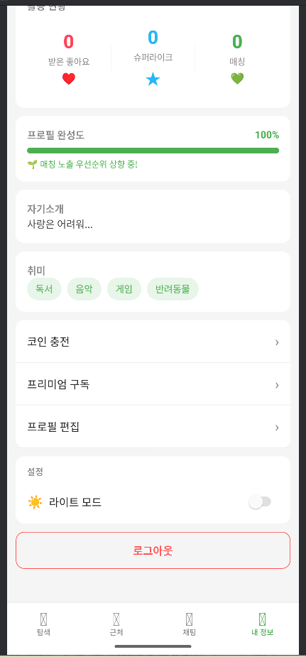</td>
    <td>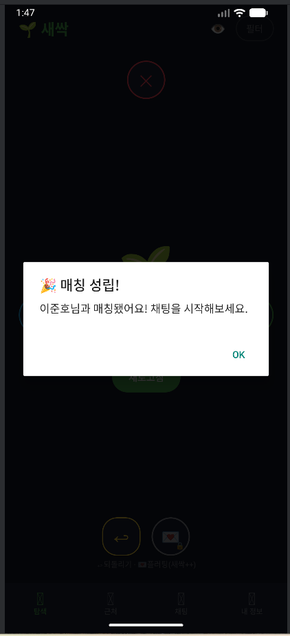</td>
    <td>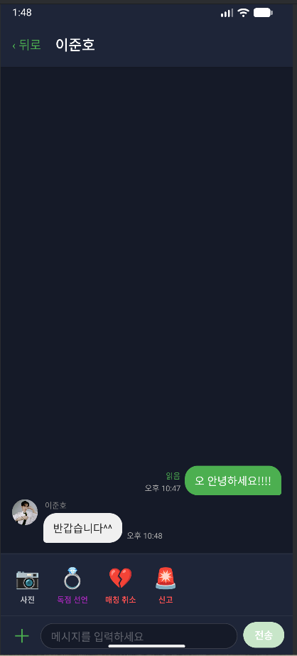</td>
    <td>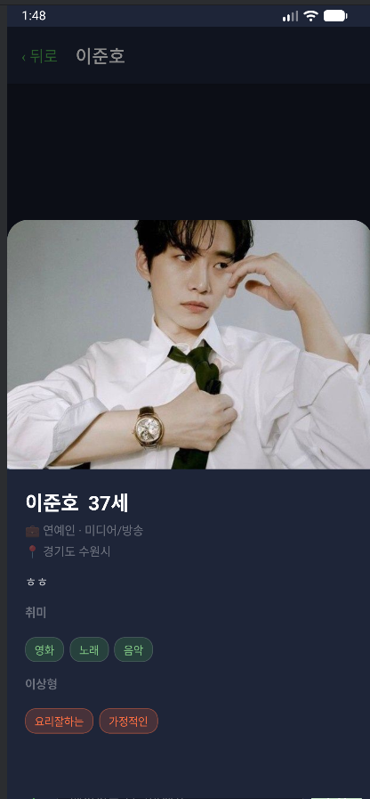</td>
  </tr>
  <tr>
    <td align="center"><b>코인 충전</b></td>
    <td align="center"><b>프리미엄 구독</b></td>
    <td></td>
    <td></td>
  </tr>
  <tr>
    <td>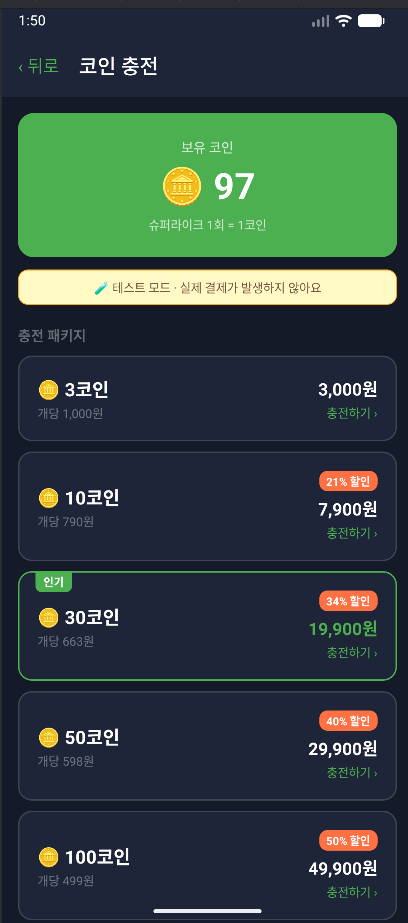</td>
    <td>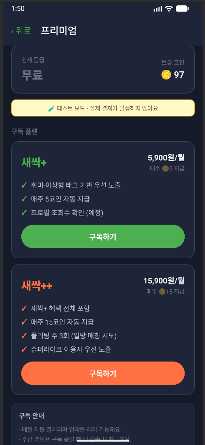</td>
    <td></td>
    <td></td>
  </tr>
</table>

<br>

## ✨ 주요 기능

### 🔐 인증
- Google · Kakao 소셜 로그인
- 프로필 완성도 표시 (항목별 가중치 계산)
- 만 18세 미만 가입 차단

### 💚 매칭
- **스와이프 탐색** — 카드 스와이프로 좋아요 / 패스 / 슈퍼라이크
- **지도 탐색** — 실시간 위치 기반 주변 유저 지도 마커 표시 (퍼지 좌표로 정확한 위치 비공개)
- **필터** — 나이 범위 · 최대 거리 · 취미 태그 필터
- 상호 좋아요 시 자동 매칭 성립 알림
- 되돌리기 (Undo) 기능
- 플러팅 선언 (새싹++ 전용) · 독점 선언

### 💬 채팅
- 매칭된 상대와 실시간 1:1 채팅 (Firestore 기반)
- 채팅방 내 상대 프로필 전체 조회 (사진 캐러셀 포함)
- 채팅방 메뉴 (신고 / 차단 등)

### 🪙 결제 (테스트 모드)
- **코인 충전** — 슈퍼라이크 사용 코인, 5개 패키지 (3 ~ 100코인)
- **프리미엄 구독** — 새싹+ (₩5,900/월) · 새싹++ (₩15,900/월), 주간 코인 자동 지급

### 🎨 기타
- **다크 / 라이트 모드** 토글 (내 정보 탭 설정 메뉴, AsyncStorage 영구 저장)

<br>

## 🛠 기술 스택

| 분류 | 기술 |
|------|------|
| 프레임워크 | React Native 0.84.1 (CLI, New Architecture) |
| 언어 | TypeScript 5.8 |
| 상태 관리 | Zustand 5 |
| 네비게이션 | React Navigation 7 (Stack + Bottom Tabs) |
| 백엔드 | Firebase (Auth · Firestore · Storage · FCM) |
| 지도 | react-native-maps (Google Maps) |
| 위치 | react-native-geolocation-service |
| 소셜 로그인 | Google Sign-In · Kakao |
| 기타 | AsyncStorage · react-native-image-picker · react-native-deck-swiper |

<br>

## 📁 프로젝트 구조

```
MyApp/src/
├── context/
│   └── ThemeContext.tsx        # 다크/라이트 테마
├── navigation/
│   ├── RootNavigator.tsx       # 인증 상태 기반 라우팅
│   ├── MainTabs.tsx            # 하단 탭 네비게이터
   └── AuthStack.tsx           # 로그인 플로우
├── screens/
│   ├── auth/                   # 랜딩 · 로그인 · 프로필 설정
│   ├── match/                  # 스와이프 · 지도 · 필터
│   ├── chat/                   # 채팅 목록 · 채팅방
│   ├── pay/                    # 코인 충전 · 프리미엄
│   └── MyProfileScreen.tsx     # 내 정보
├── store/
│   ├── authStore.ts
│   ├── matchStore.ts
│   └── chatStore.ts
├── components/
│   └── SwipeCard.tsx
└── hooks/
    └── useSubscription.ts
```

<br>

## 🚀 실행 방법

### 사전 요구사항
- Node.js 22+
- JDK 17+
- Android Studio + Android SDK
- React Native 개발 환경 세팅 ([공식 가이드](https://reactnative.dev/docs/set-up-your-environment))

### Firebase 설정
1. Firebase 콘솔에서 Android 앱 등록
2. `google-services.json` → `MyApp/android/app/` 에 배치
3. Firestore 보안 규칙 설정

### 실행

```bash
# 의존성 설치
cd MyApp
npm install

# Metro 번들러 실행
npm start

# Android 빌드 & 실행
npm run android
```

<br>

## 📋 Firestore 컬렉션 구조

| 컬렉션 | 설명 |
|--------|------|
| `profiles/{uid}` | 닉네임 · 사진 · 취미태그 · 위치(fuzzy) 등 |
| `users/{uid}` | 코인 잔액 |
| `swipes/{id}` | 좋아요 / 슈퍼라이크 / 패스 기록 |
| `matches/{id}` | 매칭 정보 (user_ids, status) |
| `chats/{matchId}/messages` | 채팅 메시지 |
| `subscriptions/{uid}` | 구독 등급 · 만료일 |

<br>

## ⚠️ 현재 제한 사항

- 결제는 **테스트 모드** (실제 과금 없음)
- 네이버 로그인 미지원 (React Native New Architecture 미호환)
- iOS 빌드 미검증 (Android 전용 개발)
