# 🌱 새싹 (SaeSak)

> **"새로운 사랑이 싹 트는 그곳"**
> 위치 기반 오프라인 만남을 연결하는 데이팅 앱

<br>

## 목차

- [화면 소개](#화면-소개)
- [주요 기능](#주요-기능)
- [기술 스택](#기술-스택)
- [프로젝트 구조](#프로젝트-구조)
- [실행 방법](#실행-방법)
- [Firestore 컬렉션 구조](#firestore-컬렉션-구조)
- [현재 제한 사항](#현재-제한-사항)
- [추후 개선할 점](#추후-개선할-점)

<br>

## 📱 화면 소개

<table>
  <tr>
    <td align="center"><b>시작 화면</b></td>
    <td align="center"><b>소셜 로그인</b></td>
    <td align="center"><b>프로필 설정</b></td>
    <td align="center"><b>스와이프 탐색</b></td>
  </tr>
  <tr>
    <td></td>
    <td>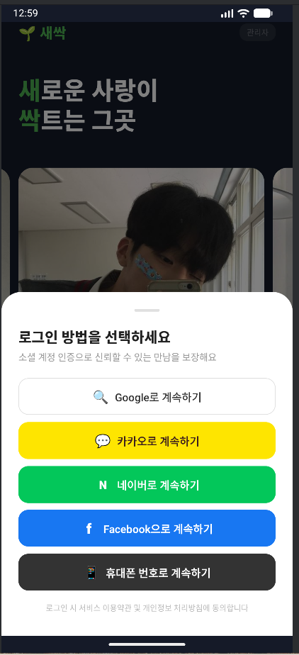</td>
    <td>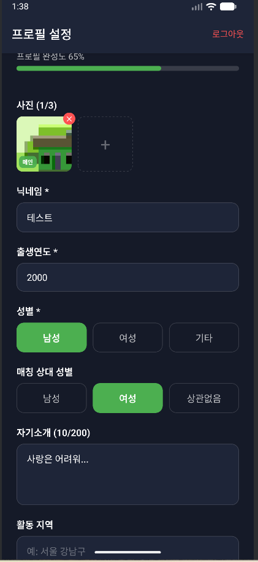</td>
    <td>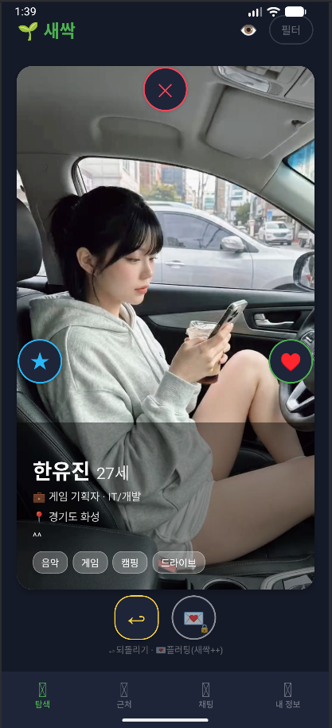</td>
  </tr>
  <tr>
    <td align="center"><b>매칭 필터</b></td>
    <td align="center"><b>지도 탐색</b></td>
    <td align="center"><b>지도 프로필 조회</b></td>
    <td align="center"><b>내 정보</b></td>
  </tr>
  <tr>
    <td>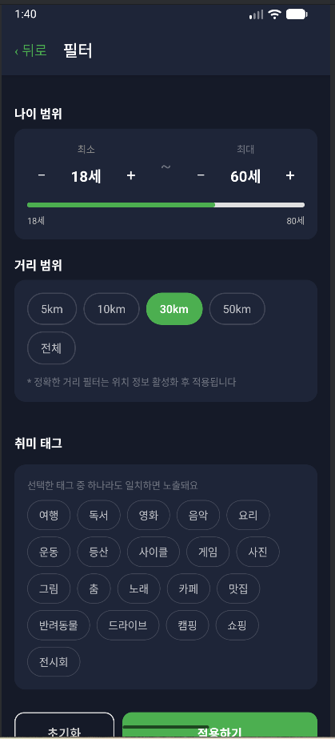</td>
    <td>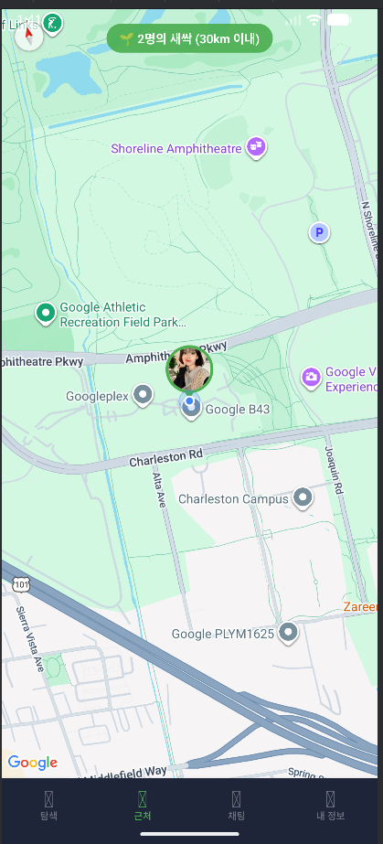</td>
    <td>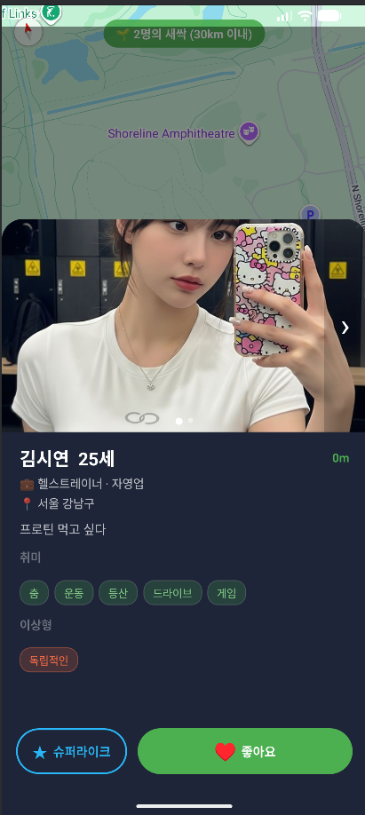</td>
    <td>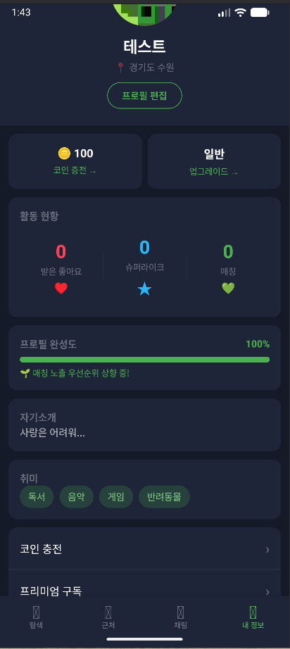</td>
  </tr>
  <tr>
    <td align="center"><b>테마 변경</b></td>
    <td align="center"><b>매칭 성립</b></td>
    <td align="center"><b>채팅방</b></td>
    <td align="center"><b>채팅 내 프로필 조회</b></td>
  </tr>
  <tr>
    <td>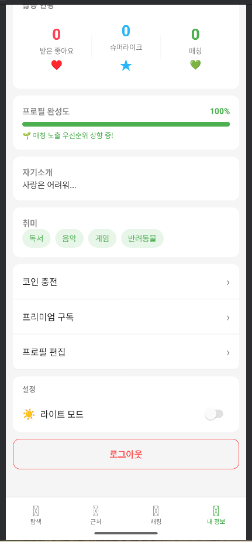</td>
    <td>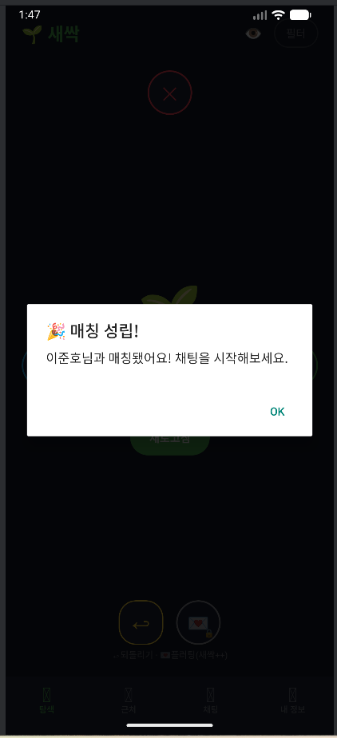</td>
    <td>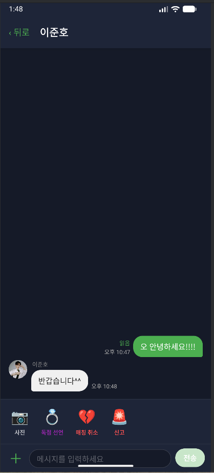</td>
    <td>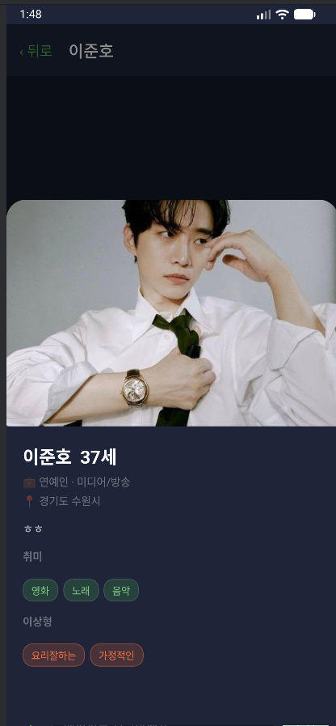</td>
  </tr>
  <tr>
    <td align="center"><b>코인 충전</b></td>
    <td align="center"><b>프리미엄 구독</b></td>
    <td></td>
    <td></td>
  </tr>
  <tr>
    <td>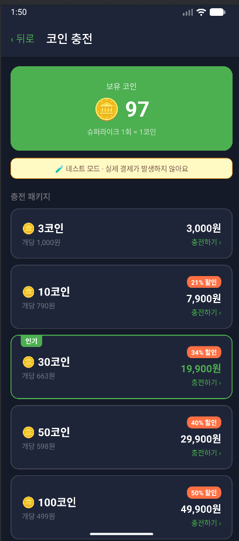</td>
    <td>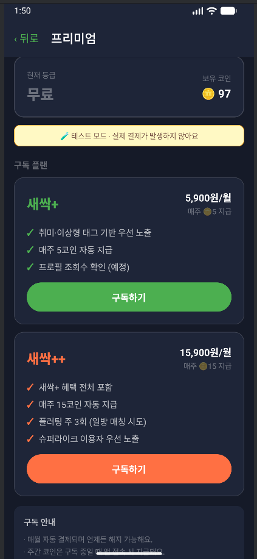</td>
    <td></td>
    <td></td>
  </tr>
</table>

<br>

## ✨ 주요 기능

### 🔐 인증
- Google · Kakao · 이메일/비밀번호 로그인
- 프로필 완성도 표시 (항목별 가중치 계산)
- 만 18세 미만 가입 차단

### 💚 매칭
- **스와이프 탐색** — 카드 스와이프로 좋아요 / 패스 / 슈퍼라이크 (슈퍼라이크 코인 1개 소모)
- **지도 탐색** — 실시간 위치 기반 주변 유저 지도 마커 표시 (퍼지 좌표로 정확한 위치 비공개)
- **필터** — 나이 범위 · 최대 거리 · 취미 태그 필터 (Zustand + AsyncStorage 영구 저장)
- 상호 좋아요 시 자동 매칭 성립 알림
- 되돌리기 (Undo) 1일 1회 무료
- 플러팅 선언 (새싹++ 전용) · 독점 선언

### 💬 채팅
- 매칭된 상대와 실시간 1:1 채팅 (Firestore `onSnapshot`)
- 이미지 전송 (Firebase Storage 업로드 후 URL 저장)
- 읽음 확인 (`read_at` timestamp)
- 채팅방 내 상대 프로필 전체 조회 (사진 캐러셀 포함)
- 채팅방 메뉴 (신고 · 차단)
- 플러팅 수신함 (받은 플러팅 목록)

### 📍 지역 연계 (부분 구현)
- **데이트 코스 추천** — UI 완성, Google Places API 연동 예정
- **지역 이벤트 / 소모임** — 이벤트 목록 · 상세 화면 구현
- **오프라인 약속 카드** — 채팅 내 날짜·장소 기반 약속 잡기

### 🪙 결제 (테스트 모드)
- **코인 충전** — 슈퍼라이크 사용 코인, 패키지 선택 (100 · 300 · 1000코인)
- **프리미엄 구독** — 새싹+ (₩5,900/월) · 새싹++ (₩15,900/월), 주간 코인 자동 지급

### 🛡️ 안전
- 프로필 · 메시지 단위 신고 (사유 선택)
- 차단 즉시 적용 (스와이프 피드 · 채팅 목록에서 자동 제거)

### 🎨 기타
- **다크 / 라이트 모드** 토글 (내 정보 탭 설정 메뉴, AsyncStorage 영구 저장)

<br>

## 🛠 기술 스택

| 분류 | 기술 |
|------|------|
| 프레임워크 | React Native 0.84.1 (CLI, New Architecture) |
| 언어 | TypeScript 5.8 |
| 상태 관리 | Zustand 5 |
| 네비게이션 | React Navigation 7 (Stack + Bottom Tabs) |
| 백엔드 | Firebase (Auth · Firestore · Storage · FCM · Cloud Functions) |
| 지도 | react-native-maps (Google Maps SDK) |
| 위치 | react-native-geolocation-service |
| 소셜 로그인 | Google Sign-In · Kakao SDK |
| 스와이프 UI | react-native-deck-swiper |
| 기타 | AsyncStorage · react-native-image-picker · react-native-gesture-handler |

<br>

## 📁 프로젝트 구조

```
MyApp/src/
├── config/
│   └── firebase.ts             # Firebase 모듈 export
├── context/
│   └── ThemeContext.tsx        # 다크/라이트 테마 (AsyncStorage 영구 저장)
├── navigation/
│   ├── RootNavigator.tsx       # 인증 상태 기반 라우팅
│   ├── MainTabs.tsx            # 하단 탭 네비게이터 (4탭)
│   └── AuthStack.tsx           # 로그인 플로우
├── screens/
│   ├── auth/                   # 랜딩 · 로그인 · 회원가입 · 프로필 설정
│   ├── match/                  # 스와이프 · 지도 · 필터
│   ├── chat/                   # 채팅 목록 · 채팅방 · 약속 카드
│   ├── local/                  # 데이트 코스 · 이벤트 목록 · 이벤트 상세
│   ├── pay/                    # 코인 충전 · 프리미엄 구독
│   └── MyProfileScreen.tsx     # 내 정보 · 테마 설정
├── components/
│   ├── SwipeCard.tsx           # 스와이프 카드
│   ├── ProfileCard.tsx         # 프로필 카드
│   ├── ChatBubble.tsx          # 채팅 말풍선
│   └── MeetingPlanCard.tsx     # 약속 카드
├── store/
│   ├── authStore.ts            # 인증 상태 (Zustand)
│   ├── matchStore.ts           # 필터 · 스와이프 기록 · 되돌리기
│   └── chatStore.ts            # 활성 채팅방 읽음 상태
├── hooks/
│   ├── useAuth.ts
│   ├── useLocation.ts
│   ├── useMatching.ts
│   └── useSubscription.ts      # 프리미엄 구독 상태 (Firestore 실시간)
├── utils/
│   ├── constants.ts            # HOBBY_TAGS · GENDERS · JOB_FIELDS
│   └── geoUtils.ts             # 거리 계산 유틸
└── types/
    └── react-native-deck-swiper.d.ts

functions/
└── index.js                    # Naver 로그인 Cloud Function
```

<br>

## 🚀 실행 방법

### 방법 1. APK 파일 직접 설치
안드로이드 환경에서 `SaeSak/app-release.apk` 파일 설치

### 방법 2. 소스에서 빌드

**사전 요구사항**
- Node.js 22+
- JDK 17+
- Android Studio + Android SDK
- React Native 개발 환경 세팅 ([공식 가이드](https://reactnative.dev/docs/set-up-your-environment))

**Firebase 설정**
1. Firebase 콘솔에서 Android 앱 등록
2. `google-services.json` → `MyApp/android/app/` 에 배치
3. Firestore 보안 규칙 설정

**실행**

```bash
# 의존성 설치
cd MyApp
npm install

# Android 빌드 & 실행
npm run android
```

<br>

## 📋 Firestore 컬렉션 구조

| 컬렉션 | 설명 |
|--------|------|
| `users/{uid}` | 코인 잔액 · 프리미엄 여부 · 차단 여부 |
| `profiles/{uid}` | 닉네임 · 사진 · 취미 태그 · 위치(fuzzy) · 완성도 |
| `swipes/{id}` | 좋아요 / 슈퍼라이크 / 패스 기록 |
| `matches/{id}` | 매칭 정보 (user_ids · status · 약속 카드) |
| `matches/{id}/messages/{id}` | 채팅 메시지 (텍스트 · 이미지 · 약속 카드) |
| `events/{id}` | 지역 이벤트 / 소모임 |
| `flirtings/{id}` | 플러팅 선언 (pending / accepted) |
| `reports/{id}` | 신고 기록 |
| `subscriptions/{uid}` | 구독 등급 · 만료일 |

<br>

## ⚠️ 현재 제한 사항

- 결제는 **테스트 모드** (실제 과금 없음)
- 네이버 로그인 미지원 (React Native New Architecture 미호환)
- iOS 빌드 미검증 (Android 전용 개발)
- 데이트 코스 추천 Google Places API 미연동 (UI만 구현)
- Cloud Vision 프로필 사진 자동 검토 미연동 (UI만 구현)

## 🧰 추후 개선할 점
- 갤럭시 하단 바 침범
- 채팅 입력 시 입력창을 가리는 문제
- 벡터 아이콘 깨짐 문제 (다른 아이콘 사용 고려)
- 소셜 로그인 삭제, 전화번호 인증으로 통일 (가상인물 우려)
- 내 활동 (좋아요 · 슈퍼라이크 내역 조회) 추가
- "활동 현황" → "받은 Hype" 메뉴명 수정
- 받은 Hype에서 긍정반응 상대 리스트 · 프로필 조회
- Google Places API 연동으로 데이트 코스 추천 완성
- RevenueCat 실결제 · NICE 본인인증 · Kakao Maps 전환 (Phase 3)
